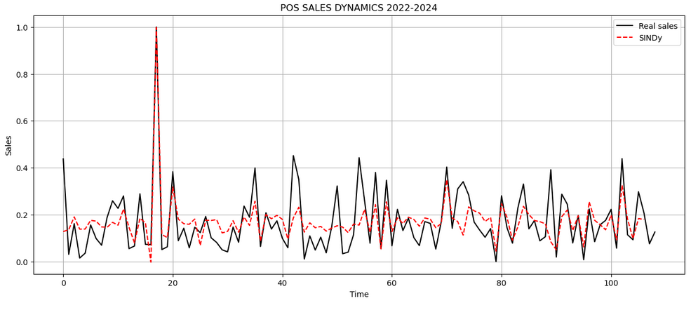

# SALES PREDICTION BY SPARSE IDENTIFICATION OF AN ERP SYSTEM FROM POS MODULE DATA

**Author:** CESAR DANIEL RINCÓN BRITO
**Institution:** UNIVERSIDAD JAVERIANA CALI

## OBJECTIVE

To adapt a method for identifying the dynamics of sparse nonlinear systems to predict the sales behavior of the POS module of an ERP system.

## Project Description

This project uses the SINDy (Sparse Identification of Nonlinear Dynamics) method to model and predict sales. The process includes:

1.  **Data loading and preprocessing**: Sales data is read from a CSV file and the relevant features are scaled.
2.  **Data splitting**: The data is divided into training, validation, and test sets.
3.  **SINDy Model**: A discrete-time SINDy model is defined and trained.
4.  **Simulation and Evaluation**: The trained model is used to simulate sales and the results are compared with the actual data to evaluate the model's performance using metrics such as R².

## Prediction Graph

*Note: To generate the graph, run the notebook `SINDY-discrete-stocastic-sales/Sindy-discrete-stocastic-sales-erp.ipynb`.*

## Libraries Used

-   pandas
-   numpy
-   scikit-learn
-   matplotlib
-   pysindy

## Repository Files

-   `SINDY-discrete-stocastic-sales/Sindy-discrete-stocastic-sales-erp.ipynb`: Jupyter notebook with the model implementation.
-   `ERP-POS-Data/Sales-CSV970-1093.csv`: Sales data used for training and validation.
-   `Matrix-Correlation/correlation_matrix.ipynb`: Notebook to analyze variable correlation.
-   `Test-Model/test_model.ipynb`: Notebook for additional model testing.