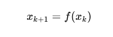

# SALES PREDICTION BY SPARSE IDENTIFICATION OF AN ERP SYSTEM FROM POS MODULE DATA

**Author:** CESAR DANIEL RINCÓN BRITO

## OBJECTIVE

Adapt a sparse nonlinear system dynamics identification method to predict the sales behavior of the POS module of an ERP system.

## INTRODUCTION

The SINDy (Sparse Identification of Nonlinear Dynamics) methodology has become a powerful tool for discovering dynamic equations from data, even in contexts where systems exhibit complex and nonlinear behaviors. In the case of discrete stochastic models, SINDy allows identifying relationships between sales variables or other processes that evolve over time under uncertainty, selecting only the most relevant terms of the model. This complexity reduction capability is key to avoiding overfitting and capturing the essence of the underlying dynamics. Furthermore, its flexibility makes it applicable in scenarios where inputs are noisy or affected by random external factors. In summary, SINDy brings interpretability and efficiency to the modeling of discrete stochastic dynamic systems, facilitating the generation of predictions and the analysis of the real dynamics of the data.

In SINDy, the dynamic system is considered a map. Instead of predicting derivatives, the right-hand side functions advance the system by one time step.

The notation xk+1 indicates that the system evolves in discrete time steps. That is, states are observed at k=0,1,2,… instead of a continuous time. In the case of sales, this corresponds to daily, weekly, or monthly records, where each observation depends on the previous one.

In the context of discrete sales, it represents a nonlinear stochastic dynamic map, capable of capturing complex patterns and generating forecasts considering both past dependencies and random fluctuations. It is useful when the data are discrete observations (daily sales, time series, sensors with sampling, etc.) rather than continuous measurements.

[SINDy Introduction](readme.sindy.en.md)

## Project Description

This project uses the SINDy (Sparse Identification of Nonlinear Dynamics) method to model and predict sales. The process includes:

1.  **Data loading and pre-processing**: Sales data is read from a CSV file and relevant features are scaled.
2.  **Data splitting**: The data is divided into training, validation, and test sets.
3.  **SINDy Model**: A discrete-time SINDy model is defined and trained.
4.  **Simulation and Evaluation**: The trained model is used to simulate sales, and the results are compared with the actual data to evaluate the model's performance using metrics such as R².

## Control Variables

| Variable | Data set | Column | Records |
|---|---|---|---|
| Sales (Pred) | y_trainDatos | Total net sales | 1093 |
| Categorical Peak | r_trainDatos | Peak B_M_A | 1093 |
| Units | x_trainDatos | Kit Units | 1093 |
| CO Sales | n_trainDatos | Center-East Sales | 1093 |
| OC Sales | k_trainDatos | West Sales | 1093 |
| NT Sales | l_trainDatos | North Sales | 1093 |
| High Peak | u_trainDatos | Peak 1/0 | 1093 |

Table 1. Control variables.

## Control Variables

1. \(u_{1r,k}\): Categorical Peak (High - Medium - Low) Promotions, Special Dates.
2. \(u_{2x,k}\): Kit Units
3. \(u_{3n,k}\): Center-East Sales
4. \(u_{4k,k}\): West Sales
5. \(u_{5l,k}\): North Sales
6. \(u_{6u,k}\): Peak 1/0

The model indicates that future sales depend not only on the current level of sales but also on multiple external factors that change over time.

## SINDy

*** STLSQ *** (Sequentially Thresholded Least Squares).

Calculates a linear regression to approximate the dynamics with a threshold (threshold=0.05), the smallest (less influential) coefficients are eliminated, leaving only the most important terms.

from eq. 3 SINDy looks for a sparsity model

*** feature library *** ps.PolynomialLibrary(degree=2)
Constructs the matrix Θ(X,U), which contains all candidate functions (polynomial terms up to degree 2).

where SINDy seeks the combination of these functions that best represents the dynamics

*** Discrete time *** (discrete_time=True)

Indicates that the system is not in continuous form (derivatives), but in discrete steps. Instead of approximating x˙(t) (derivatives), it directly adjusts the step-by-step evolution.

## Model

## Coefficients

*** Most relevant linear terms ***

nVtaCO = +0.30 → Sales in the Center-West region have a direct positive effect on the dependent variable "Sales".

The other linear terms (rPicoBMA, xUnd, kVtaOCC, lVtaNT, uPicoBin) appear with very low or near-zero coefficients → little direct influence.

*** Strong interactions with Sales ***

Sales * xUnd = +0.72 → Past sales multiplied by "units sold" are a strong positive predictor: when both grow together, future sales grow.

Sales * nVtaCO = -0.82 → Strong but negative relationship: a simultaneous increase in sales and sales in the Center-West.

Sales * uPicoBin = -0.14 → Weakly negative relationship.

*** Interactions between control variables ***

rPicoBMA * xUnd = +0.23 → If the BMA peak increases and units sold also rise, it provides a positive boost.

rPicoBMA * nVtaCO = -0.52 → Strong negative interaction.

xUnd * nVtaCO = -0.53 → Also strong and negative.

nVtaCO * lVtaNT = +0.30 and kVtaOCC * ^2 = +0.27 → These appear as positive nonlinear effects.

*** Quadratic terms ***

nVtaNT^2 = -0.15 → Large increases in sales in the North have a decreasing effect.

kVtaOCC^2 = +0.27 → Accelerated growth: sales in the West behave in a non-linear expansive manner.

## Prediction Graph

*Note: To generate the graph, run the notebook `SINDY-discrete-stocastic-sales/Sindy-discrete-stocastic-sales-erp.ipynb`.*

## Libraries Used

-   pandas
-   numpy
-   scikit-learn
-   matplotlib
-   pysindy

## Repository Files

-   `SINDY-discrete-stocastic-sales/Sindy-discrete-stocastic-sales-erp.ipynb`: Jupyter notebook with the model implementation.
-   `ERP-POS-Data/Sales-CSV970-1093.csv`: Sales data used for training and validation.
-   `Matrix-Correlation/correlation_matrix.ipynb`: Notebook to analyze variable correlation.
-   `Test-Model/test_model.ipynb`: Notebook for additional model testing.