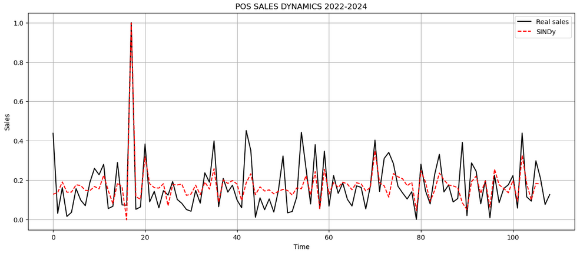

# PREDICCIÓN DE VENTAS POR IDENTIFICACIÓN DISPERSA DE UN SISTEMA ERP A PARTIR DE DATOS DE UN MÓDULO POS

**Autor:** CESAR DANIEL RINCÓN BRITO
**Institución:** UNIVERSIDAD JAVERIANA CALI
**Institución:** PROGRAMA DE MAESTRÍA EN INGENIERÍA

## OBJETIVO

Adaptar un método de identificación de la dinámica de sistemas no lineales dispersos para predecir el comportamiento de las ventas del módulo POS de un sistema ERP.

## INTRODUCCIÓN

La metodología SINDy (Sparse Identification of Nonlinear Dynamics) se ha convertido en una herramienta poderosa para descubrir ecuaciones dinámicas a partir de datos, incluso en contextos donde los sistemas presentan comportamientos complejos y no lineales. En el caso de modelos discretos estocásticos, SINDy permite identificar relaciones entre variables de ventas u otros procesos que evolucionan en el tiempo bajo incertidumbre, seleccionando solo los términos más relevantes del modelo. Esta capacidad de reducción de complejidad es clave para evitar el sobreajuste y capturar la esencia de la dinámica subyacente. Además, su flexibilidad lo hace aplicable en escenarios donde las entradas son ruidosas o están afectadas por factores externos aleatorios. En síntesis, SINDy aporta interpretabilidad y eficiencia en la modelación de sistemas dinámicos discretos estocásticos, facilitando la generación de predicciones y el análisis de la dinámica real de los datos.

En SINDy el sistema dinámico se considera un mapa. En lugar de predecir derivadas, las funciones del lado derecho avanzan el sistema un paso de tiempo.

\( x_{k+1} = f(x_k) \)

Es útil cuando los datos son observaciones discretas (ventas diarias, series temporales, sensores con sampling, etc.) en lugar de mediciones continuas.

## Descripción del Proyecto

Este proyecto utiliza el método SINDy (Sparse Identification of Nonlinear Dynamics) para modelar y predecir las ventas. El proceso incluye:

1.  **Carga y pre-procesamiento de datos**: Se leen los datos de ventas desde un archivo CSV y se escalan las características relevantes.
2.  **División de datos**: Los datos se dividen en conjuntos de entrenamiento, validación y prueba.
3.  **Modelo SINDy**: Se define y entrena un modelo SINDy de tiempo discreto.
4.  **Simulación y Evaluación**: El modelo entrenado se utiliza para simular las ventas y los resultados se comparan con los datos reales para evaluar el rendimiento del modelo utilizando métricas como el R².

## Variables de control

| Variable        | Data set       | Columna              | Registros |
|-----------------|----------------|----------------------|-----------|
| Ventas (Pred)   | y_trainDatos   | Total venta neta     | 1093      |
| Pico categórica | r_trainDatos   | Pico B_M_A           | 1093      |
| Unidades        | x_trainDatos   | Unidades Kit         | 1093      |
| Vta CO          | n_trainDatos   | Ventas centro oriente | 1093      |
| Vta OC          | k_trainDatos   | Ventas occidente     | 1093      |
| Vta NT          | l_trainDatos   | Ventas norte         | 1093      |
| Pico alto       | u_trainDatos   | Pico 1/0             | 1093      |

Tabla 1. Variables de control.

## Gráfico de Predicción

*Nota: Para generar el gráfico, ejecute el notebook `SINDY-discrete-stocastic-sales/Sindy-discrete-stocastic-sales-erp.ipynb`.*

## Librerías Utilizadas

-   pandas
-   numpy
-   scikit-learn
-   matplotlib
-   pysindy

## Archivos del Repositorio

-   `SINDY-discrete-stocastic-sales/Sindy-discrete-stocastic-sales-erp.ipynb`: Notebook de Jupyter con la implementación del modelo.
-   `ERP-POS-Data/Sales-CSV970-1093.csv`: Datos de ventas utilizados para el entrenamiento y la validación.
-   `Matrix-Correlation/correlation_matrix.ipynb`: Notebook para analizar la correlación de variables.
-   `Test-Model/test_model.ipynb`: Notebook para pruebas adicionales del modelo.
