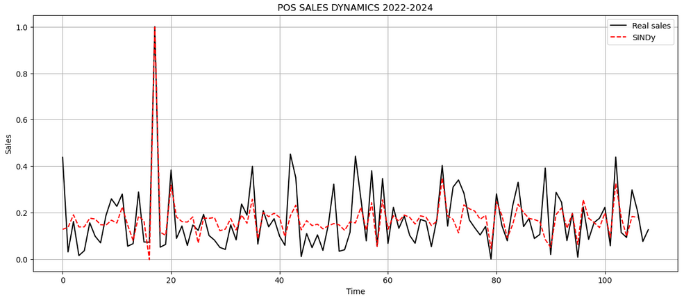

# PREDICCIÓN DE VENTAS POR IDENTIFICACIÓN DISPERSA DE UN SISTEMA ERP A PARTIR DE DATOS DE UN MÓDULO POS

**Autor:** CESAR DANIEL RINCÓN BRITO
**Institución:** UNIVERSIDAD JAVERIANA CALI
**Institución:** PROGRAMA DE MAESTRÍA EN INGENIERÍA

## OBJETIVO

Adaptar un método de identificación de la dinámica de sistemas no lineales dispersos para predecir el comportamiento de las ventas del módulo POS de un sistema ERP.

## INTRODUCCIÓN

Adaptar un método de identificación de la dinámica de sistemas no lineales dispersos para predecir el comportamiento de las ventas del módulo POS de un sistema ERP.

## Descripción del Proyecto

Este proyecto utiliza el método SINDy (Sparse Identification of Nonlinear Dynamics) para modelar y predecir las ventas. El proceso incluye:

1.  **Carga y pre-procesamiento de datos**: Se leen los datos de ventas desde un archivo CSV y se escalan las características relevantes.
2.  **División de datos**: Los datos se dividen en conjuntos de entrenamiento, validación y prueba.
3.  **Modelo SINDy**: Se define y entrena un modelo SINDy de tiempo discreto.
4.  **Simulación y Evaluación**: El modelo entrenado se utiliza para simular las ventas y los resultados se comparan con los datos reales para evaluar el rendimiento del modelo utilizando métricas como el R².

## Gráfico de Predicción

*Nota: Para generar el gráfico, ejecute el notebook `SINDY-discrete-stocastic-sales/Sindy-discrete-stocastic-sales-erp.ipynb`.*

## Librerías Utilizadas

-   pandas
-   numpy
-   scikit-learn
-   matplotlib
-   pysindy

## Archivos del Repositorio

-   `SINDY-discrete-stocastic-sales/Sindy-discrete-stocastic-sales-erp.ipynb`: Notebook de Jupyter con la implementación del modelo.
-   `ERP-POS-Data/Sales-CSV970-1093.csv`: Datos de ventas utilizados para el entrenamiento y la validación.
-   `Matrix-Correlation/correlation_matrix.ipynb`: Notebook para analizar la correlación de variables.
-   `Test-Model/test_model.ipynb`: Notebook para pruebas adicionales del modelo.
