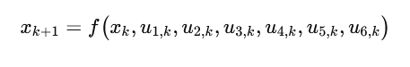
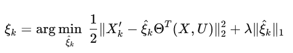

# PREDICCIÓN DE VENTAS POR IDENTIFICACIÓN DISPERSA DE UN SISTEMA ERP A PARTIR DE DATOS DE UN MÓDULO POS

**Autor:** CESAR DANIEL RINCÓN BRITO https://orcid.org/0009-0007-9999-6889

[](https://doi.org/10.5281/zenodo.17561088)

## OBJETIVO

Adaptar un método de identificación de la dinámica de sistemas no lineales dispersos para predecir el comportamiento de las ventas del módulo POS de un sistema ERP.

## INTRODUCCIÓN

La metodología SINDy (Sparse Identification of Nonlinear Dynamics) se ha convertido en una herramienta poderosa para descubrir ecuaciones dinámicas a partir de datos, incluso en contextos donde los sistemas presentan comportamientos complejos y no lineales. En el caso de modelos discretos estocásticos, SINDy permite identificar relaciones entre variables de ventas u otros procesos que evolucionan en el tiempo bajo incertidumbre, seleccionando solo los términos más relevantes del modelo. Esta capacidad de reducción de complejidad es clave para evitar el sobreajuste y capturar la esencia de la dinámica subyacente. Además, su flexibilidad lo hace aplicable en escenarios donde las entradas son ruidosas o están afectadas por factores externos aleatorios. En síntesis, SINDy aporta interpretabilidad y eficiencia en la modelación de sistemas dinámicos discretos estocásticos, facilitando la generación de predicciones y el análisis de la dinámica real de los datos.

En SINDy el sistema dinámico se considera un mapa. En lugar de predecir derivadas, las funciones del lado derecho avanzan el sistema un paso de tiempo.


La notación xk+1 indica que el sistema evoluciona en pasos de tiempo discretos. Es decir, se observan estados en k=0,1,2,… en lugar de un tiempo continuo.
En el caso de ventas, esto corresponde a registros diarios, semanales o mensuales, donde cada observación depende de la anterior.

En el contexto de ventas discretas representa un mapa dinámico estocástico no lineal, capaz de capturar patrones complejos y de generar pronósticos considerando tanto dependencias pasadas como fluctuaciones aleatorias. Es útil cuando los datos son observaciones discretas (ventas diarias, series temporales, sensores con sampling, etc.) en lugar de mediciones continuas.

[Introducción SINDy](readme.sindy.md)

## Descripción del Proyecto

Este proyecto utiliza el método SINDy (Sparse Identification of Nonlinear Dynamics) para modelar y predecir las ventas. El proceso incluye:

1.  **Carga y pre-procesamiento de datos**: Se leen los datos de ventas desde un archivo CSV y se escalan las características relevantes.
2.  **División de datos**: Los datos se dividen en conjuntos de entrenamiento, validación y prueba.
3.  **Modelo SINDy**: Se define y entrena un modelo SINDy de tiempo discreto.
4.  **Simulación y Evaluación**: El modelo entrenado se utiliza para simular las ventas y los resultados se comparan con los datos reales para evaluar el rendimiento del modelo utilizando métricas como el R².

## Variables de control

| Variable        | Data set       | Columna              | Registros |
|-----------------|----------------|----------------------|-----------|
| Ventas (Pred)   | y_trainDatos   | Total venta neta     | 1093      |
| Pico categórica | r_trainDatos   | Pico B_M_A           | 1093      |
| Unidades        | x_trainDatos   | Unidades Kit         | 1093      |
| Vta CO          | n_trainDatos   | Ventas centro oriente | 1093      |
| Vta OC          | k_trainDatos   | Ventas occidente     | 1093      |
| Vta NT          | l_trainDatos   | Ventas norte         | 1093      |
| Pico alto       | u_trainDatos   | Pico 1/0             | 1093      |

Tabla 1. Variables de control.


## Variables de control

1. \(u_{1r,k}\): Pico categórica (Alto - Medio - Bajo) Promociones, Fechas especiales.  
2. \(u_{2x,k}\): Unidades Kit
3. \(u_{3n,k}\): Ventas centro oriente 
4. \(u_{4k,k}\): Ventas occidente  
5. \(u_{5l,k}\): Ventas norte 
6. \(u_{6u,k}\): Pico 1/0 



El modelo indica que las ventas futuras dependen no solo del nivel actual de ventas, sino también de múltiples factores externos que cambian con el tiempo.


## SINDy


*** STLSQ *** (Sequentially Thresholded Least Squares).

Calcula una regresión lineal para aproximar la dinámica con un umbral (threshold=0.05), los coeficientes más pequeños (menos influyentes) se eliminan, quedando solo los términos más importantes.



de la eq. 3 SINDy busca un modelo sparsity 

*** feature library *** ps.PolynomialLibrary(degree=2)
Construye la matriz Θ(X,U), que contiene todas las funciones candidato (términos polinómicos hasta grado 2).


donde SINDy busca la combinación de estas funciones que mejor represente la dinámica

*** Discrete time *** (discrete_time=True)

Indica que el sistema no está en forma continua (derivadas), sino en pasos discretos. En lugar de aproximar x˙(t) (derivadas), ajusta directamente la evolución paso a paso.


## Data


La gráfica ilustra cómo el modelo se entreentrenará con el 90% de los datos y luego se evalúa en el 10% restante. Las 6 trayectorias representan el comportamiento de las variables clave de control, mostrando si el modelo logra seguir sus tendencias y variaciones fuera del set de entrenamiento.

## Modelo


## Coeficientes


### Interpretación por tipo de término

1. **Constante (1 → 0.17)**

   * El modelo predice un “nivel base” de ventas independiente de las variables.

2. **Términos lineales (Ventas, rPicoBMA, xUnd, kVtaOCC, lVtaNT, etc.)**

   * Ejemplo: `Ventas` (0.65) significa que el valor de ventas pasadas influye **positivamente** en las futuras.
   * `rPicoBMA` (–0.72) impacta de manera **negativa**: cuando aumenta este indicador, las ventas tienden a bajar.

3. **Cuadráticos (Ventas², nVtaCO², etc.)**

   * `Ventas²` (0.91) y `nVtaCO²` (1.11) muestran que hay **efectos no lineales fuertes**, donde el crecimiento no es proporcional.
   * Estos términos indican que la relación entre variables y ventas **no es lineal simple**, sino que hay aceleraciones o saturaciones.

4. **Términos cruzados (interacciones, ej. Ventas × rPicoBMA, xUnd × nVtaCO, etc.)**

   * `Ventas × kVtaOCC` (–0.94) muestra que la combinación entre ventas previas y occidente reduce el valor futuro → interacción negativa.
   * `xUnd × kVtaOCC` (0.45) es positiva: cuando ambas crecen, se refuerzan.

## Gráfico de Predicción


*Nota: Para generar el gráfico, ejecute el notebook `SINDY-discrete-stocastic-sales/Sindy-discrete-stocastic-sales-erp.ipynb`.*

## Librerías Utilizadas

-   pandas
-   numpy
-   scikit-learn
-   matplotlib
-   pysindy

## Archivos del Repositorio

-   `SINDY-discrete-stocastic-sales/Sindy-discrete-stocastic-sales-erp.ipynb`: Notebook de Jupyter con la implementación del modelo.
-   `ERP-POS-Data/Sales-CSV970-1093.csv`: Datos de ventas utilizados para el entrenamiento y la validación.
-   `Matrix-Correlation/correlation_matrix.ipynb`: Notebook para analizar la correlación de variables.
-   `Test-Model/test_model.ipynb`: Notebook para pruebas adicionales del modelo.

---

## Modelo v2: Entrenamiento, Validación y Prueba

### Dataset: Sales-CSV-1201-Train-Value-Test.csv

División del dataset con **1201 registros** para entrenamiento, validación y prueba independiente:

| Conjunto | Registros | Índices | Período |
|----------|-----------|---------|---------|
| **Train** | 976 | 0-975 | 2022-01-02 a 2024-09-06 |
| **Validación** | 109 | 976-1084 | 2024-09-07 a 2024-12-24 |
| **Test** | 109 | 1092-1200 | 2025-09-07 a 2025-12-24 |

Tabla 2. División del dataset para entrenamiento, validación y prueba.

### Variables de Control v2

| Variable | Dataset | Columna | Descripción |
|----------|---------|---------|-------------|
| y (Predicción) | TotalVentaNeta | Total venta neta | Variable objetivo a predecir |
| r | Pico_B_M_A | Pico categórica | Alto - Medio - Bajo (0.33, 0.66, 1.0) |
| x | UnidadesKit | Unidades vendidas | Cantidad de kits vendidos |
| n | VentasCENTROORIENTE | Ventas región CO | Ventas en centro oriente |
| k | VentasOCCIDENTE | Ventas región OC | Ventas en occidente |
| l | VentasNORTE | Ventas región NT | Ventas en norte |
| u | EsFechaEspecial | Fecha especial | Indicador binario (0/1) |

Tabla 3. Variables de control modelo v2.

### Ecuación del Modelo SINDy v2

El modelo SINDy identificó la siguiente ecuación dinámica discreta con **34 términos activos** (threshold = 0.01, alpha = 0.05):

```
y[k+1] = 0.006
       + 0.529·y[k]
       - 0.199·r[k] + 0.674·x[k] - 0.071·n[k] - 0.107·k[k] + 0.036·l[k] - 0.009·u[k]
       + 1.103·y[k]²
       - 0.482·y[k]·r[k] - 0.198·y[k]·x[k] - 2.742·y[k]·k[k] - 0.221·y[k]·l[k] - 0.028·y[k]·u[k]
       + 0.294·r[k]² - 0.259·r[k]·x[k] + 0.397·r[k]·n[k] + 0.992·r[k]·k[k] + 0.121·r[k]·l[k]
       - 1.728·x[k]² + 0.217·x[k]·n[k] + 0.815·x[k]·k[k] + 0.261·x[k]·l[k] - 0.117·x[k]·u[k]
       + 0.735·n[k]² - 1.260·n[k]·k[k] + 0.107·n[k]·u[k]
       + 0.664·k[k]² + 0.330·k[k]·l[k] + 0.086·k[k]·u[k]
       - 0.076·l[k]²
```

### Métricas de Rendimiento

| Conjunto | Registros | R² |
|----------|-----------|------|
| **Validación** | 109 | 0.7006 |
| **Test (2025)** | 109 | 0.6691 |

Tabla 4. Métricas de rendimiento del modelo v2.

**Correlación de Pearson:**
- Validación: r = 0.8370 (p-value < 0.001)
- Test: r = 0.8180 (p-value < 0.001)

### Resultados Gráficos

#### Comparación Validación y Test


*Figura 1. Series temporales y gráficos de dispersión para los conjuntos de validación (R²=0.7006) y test (R²=0.6691).*

#### Predicción vs Real en Test (2025)


*Figura 2. Comparación detallada entre valores reales y predicciones del modelo SINDy para el conjunto de test (período 2025). Izquierda: serie temporal. Derecha: gráfico de dispersión con correlación r=0.8180.*

### Conclusiones

1. **Capacidad de Generalización**: El modelo SINDy demuestra buena capacidad de generalización, manteniendo un R² de 0.6691 en el conjunto de test (datos de 2025) que no fueron vistos durante el entrenamiento.

2. **Correlación Significativa**: Las correlaciones de Pearson superiores a 0.81 en validación y test indican una relación fuerte y estadísticamente significativa entre las predicciones y los valores reales.

3. **Interpretabilidad**: A diferencia de modelos de caja negra, SINDy proporciona una ecuación explícita que permite entender cómo las variables de control influyen en las ventas futuras.

4. **Interacciones No Lineales**: El modelo captura interacciones cuadráticas y cruzadas entre variables (como y·r, y·x, r·n), revelando relaciones complejas en la dinámica de ventas.

5. **Aplicabilidad Práctica**: Con un MAPE cercano al 48% en test, el modelo es útil para identificar tendencias y patrones, aunque las predicciones puntuales tienen margen de mejora debido a la naturaleza estocástica de las ventas.

*Nota: Para reproducir estos resultados, ejecute el notebook `SINDY-discrete-stocastic-sales/Sindy-discrete-stocastic-sales-erp(Train-Test-Val).ipynb` con el dataset `ERP-POS-Data/Sales-CSV-1201-Train-Value-Test.csv`.*
