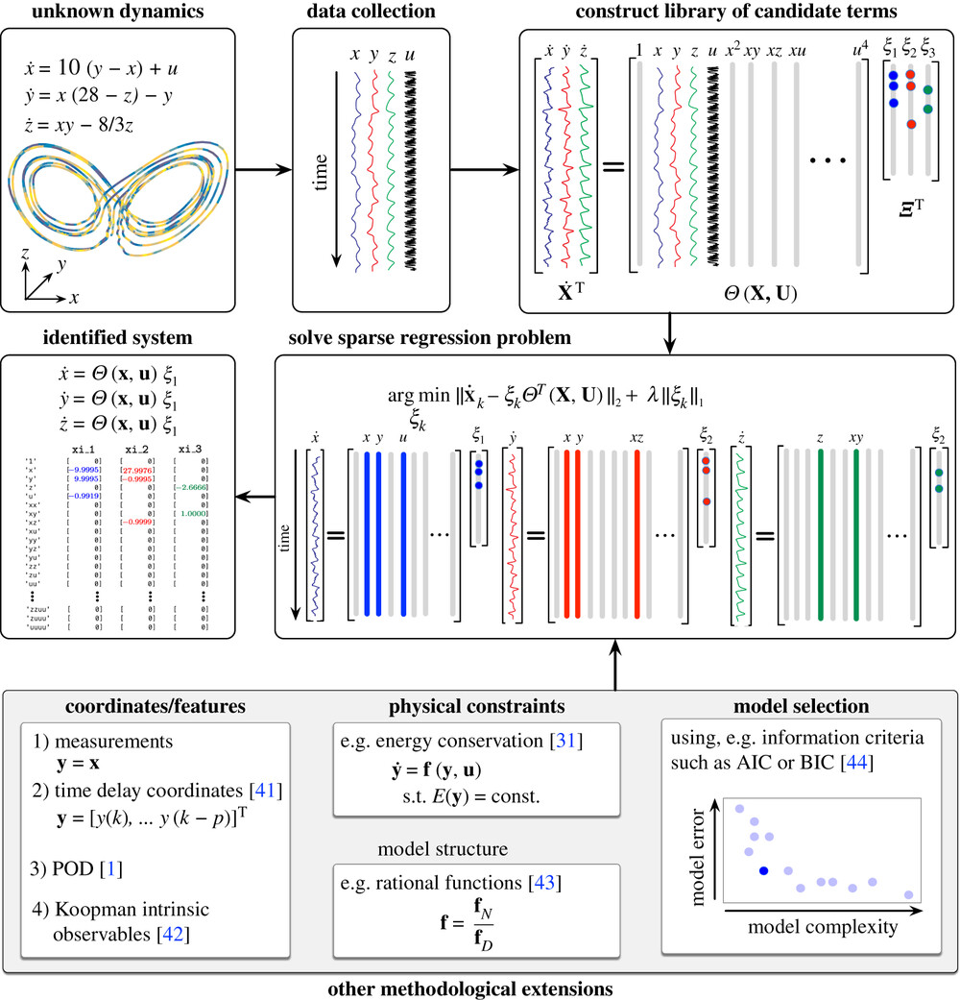

# SINDy: Sparse Identification of Nonlinear Dynamics from Data

This document describes the workflow of the SINDy (Sparse Identification of Nonlinear Dynamics) method.

## Introduction to SINDy

SINDy is a method for discovering the underlying mathematical model of a dynamical system from time-series data. The goal is to find a model that is both accurate and parsimonious (sparse), meaning it uses the fewest possible terms to describe the system's dynamics.

## The SINDy Workflow

The process, as illustrated in the image, can be broken down into the following steps:

1.  **Unknown Dynamics and Data Collection**:
    *   It starts with a system with unknown dynamics (e.g., the Lorenz attractor shown in the image).
    *   Time-series data is collected from the system's variables (x, y, z) and, optionally, a control signal (u).

2.  **Construct a Library of Candidate Functions**:
    *   The numerical derivatives of the measured data (ẋ, ẏ, ż) are calculated.
    *   A library of candidate functions, Θ(X, U), is constructed. This can include polynomial terms (x, y, z, x², xy, etc.) and other nonlinear terms that might be part of the system's dynamics.

3.  **Solve a Sparse Regression Problem**:
    *   The core of SINDy is to formulate a linear regression problem to find the coefficients (Ξ) that best relate the derivatives to the library of candidate functions.
    *   A sparse regression technique (like Lasso regression) is used to find a solution where most of the coefficients are zero. This is achieved by minimizing a cost function that penalizes both the model error and the number of non-zero terms (L1 norm).

4.  **Identified System**:
    *   The non-zero coefficients in the Ξ matrix reveal the active terms in the system's dynamics.
    *   The result is a simple, interpretable model of ordinary differential equations that describes the system's evolution.

## Methodological Extensions

The SINDy method can be extended and improved through several techniques:

*   **Coordinates/Features**: Using different coordinate systems, such as time-delay coordinates or Koopman intrinsic observables.
*   **Physical Constraints**: Incorporating known conservation laws (e.g., energy conservation) into the fitting process.
*   **Model Selection**: Using information criteria (like AIC or BIC) to balance model complexity and error, helping to select the best model.
